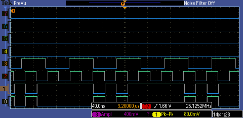

# differential DDR

using [Lattice ICE40HX](http://www.latticesemi.com/Products/FPGAandCPLD/iCE40.aspx#_21E33C7EC0BD48AA80FE384ED73CC895)

[The IceStorm flow (Yosys, Arachne-pnr, and IceStorm) is a fully open source Verilog-to-Bitstream flow for iCE40 FPGAs](http://www.clifford.at/icestorm/)

* Trace 3: system clock 12MHz
* Trace 2: DDR clock from PLL 25Mhz
* Trace 1: DDR differential positive
* Trace 0: DDR differential negative

# docs

PLL and DDR are setup with SB_IO and SB_PLL primitives:

* [PLL details](http://www.latticesemi.com/view_document?document_id=47778)
* [DDR details](http://www.latticesemi.com/view_document?document_id=47960)
